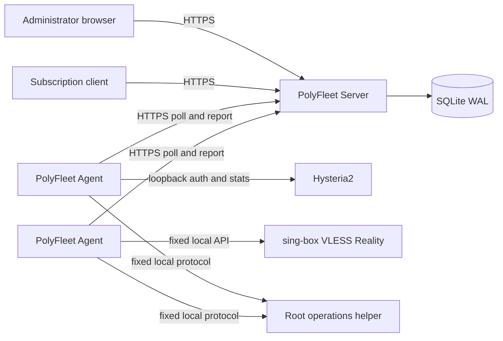

# PolyFleet

[](https://github.com/Sen62455/PolyFleet/actions/workflows/ci.yml)
[](https://github.com/Sen62455/PolyFleet/actions/workflows/release.yml)
[](LICENSE)

PolyFleet is a lightweight, self-hosted control plane for small multi-protocol
proxy fleets. It centralizes users, node assignments, traffic, subscriptions,
host monitoring, alerts, and bounded operations while keeping each proxy data
plane independent from the controller.

PolyFleet is intended for personal and small shared fleets on low-resource VPS
hosts. The stack is a Go Server, an embedded Vue console, SQLite, and one small
outbound-only Agent per node. Redis, PostgreSQL, Kubernetes, and a message broker
are not required.

For a guided Chinese installation, start with the
[Chinese beginner guide](docs/quick-start.zh-CN.md). Existing HyFleet operators
should read the [in-place migration guide](docs/migration-from-hyfleet.zh-CN.md).

## Highlights

- Manage global users, expiry, enable state, node assignments, independent
  per-node credentials, and global or per-node traffic limits.
- Fully manage native Hysteria2 and the pinned VLESS/TCP/Reality sing-box
  profile through typed adapters instead of arbitrary configuration injection.
- Generate rotatable and revocable subscriptions in URI, Base64, Mihomo/Clash,
  and sing-box formats.
- Account for upload and download through a durable Agent Outbox and idempotent
  controller aggregation. Traffic quotas count both directions.
- Observe online users and connections, disconnect a selected user, monitor host
  resources and core state, and retain bounded metric history.
- Track a manually configured monthly traffic allowance for each node, including
  reset day and provider-console calibration when no provider API is available.
- Run allowlisted core probes, restarts, limited log reads, and bounded local
  configuration backups without exposing a remote shell.
- Reconcile desired state asynchronously and surface pending, applied, failed,
  stale, and offline states explicitly.
- Build checksum-verified amd64/arm64 releases with SPDX SBOMs and keyless
  Sigstore signatures.

## Architecture



The Server never opens an inbound management port on a node. Each Agent initiates
HTTPS requests, applies only newer typed desired state, keeps its last valid local
state, and queues traffic or operation results until the Server acknowledges
them. A controller outage therefore does not become a proxy data-plane outage.

## Adapter support

| Adapter | Management level | Users and traffic | Intended use |
| --- | --- | --- | --- |
| Native Hysteria2 | Managed | Users, subscriptions, bidirectional traffic, online state and kick | New or migrated Hysteria2 nodes |
| VLESS/TCP/Reality | Managed pinned profile | Users, subscriptions, bidirectional traffic, active connections and kick | Clean dedicated Reality nodes |
| S-UI v1.5.x | Compatibility/import | Managed only after explicit adoption | Migration from an existing S-UI node |
| Standalone sing-box | Observation only | No user or subscription ownership | Temporary inventory and monitoring |

PolyFleet does not silently adopt or rewrite resources that it does not own.
The Reality adapter intentionally manages one audited profile: VLESS over direct
TCP, Reality, and `xtls-rprx-vision`. It is not an arbitrary sing-box JSON panel.
See the [compatibility matrix](docs/compatibility.md) before onboarding a node.

## Requirements

- Server and Agent: Debian 12/13 or Ubuntu 24.04 with systemd, `amd64` or
  `arm64`. Docker Engine with Compose v2 is supported for the Server only.
- A dedicated HTTPS origin for the control plane. Native installation binds the
  Server to loopback and expects a reverse proxy such as Caddy or Nginx.
- Outbound HTTPS connectivity from every Agent to the Server.
- Native Hysteria2 requires an independently working Hysteria2 core. A clean
  Reality Agent installation uses the pinned sing-box binary in the release.

## Quick install

Choose a reviewed release tag and fetch the bootstrap from that same immutable
tag:

```bash
VERSION='v1.3.0'
curl --fail --location --proto '=https' --tlsv1.2 \
  -o install.sh \
  "https://raw.githubusercontent.com/Sen62455/PolyFleet/${VERSION}/install.sh"
less install.sh
sudo bash install.sh server \
  --version "${VERSION}" \
  --public-url https://panel.example.com
```

After configuring HTTPS and creating the first administrator, create a node and
its one-time enrollment token in the console. Run the same bootstrap on the node:

```bash
sudo bash install.sh agent \
  --version "${VERSION}" \
  --server-url https://panel.example.com \
  --node-name example-node \
  --adapter native-hysteria2 \
  --core-config-path /etc/hysteria/config.yaml
```

Enrollment is interactive so the token is not written to shell history. The
bootstrap verifies the external SHA-256 file, all packaged files, host OS, and
binary architecture before invoking the native installer.

## Upgrade, backup, and restore

Server upgrades must precede Agent upgrades. The updater verifies both checksum
layers, saves a rollback snapshot, performs component health checks, and restores
the previous component on failure:

```powershell
.\scripts\deploy-fleet.ps1 -Version v1.3.0
```

Create a consistent native Server backup with:

```bash
sudo bash deploy/backup-server.sh --output-dir /var/backups/hyfleet
```

The database archive and encryption master key are separate recovery artifacts.
Both are required to recover managed credentials. Store them in separate,
encrypted off-host locations and test restoration.

## Compatibility with HyFleet

PolyFleet `v1.3.0` is an in-place successor to HyFleet `v1.2.x`. To avoid a risky
flag-day migration it deliberately retains these compatibility interfaces:

- `hyfleet-server`, `hyfleet-agent`, `hyfleet-agent-ops` and existing systemd
  unit names;
- `/etc/hyfleet`, `/var/lib/hyfleet*`, `HYFLEET_*`, and `X-HyFleet-*`;
- the local Reality API path and pinned sing-box compatibility version suffix.

These names are runtime ABI, not the product brand. They allow an existing
database, master key, Agent identity, authentication cache, and rollback snapshot
to continue working unchanged. New public release assets use `polyfleet-*`, and
the Server container is `ghcr.io/sen62455/polyfleet`.

## Development

The supported toolchain is Go 1.26, Node.js 22, and pnpm 11.16.

```bash
go mod verify
go test ./...
go vet ./...
pnpm --dir web install --frozen-lockfile
pnpm --dir web typecheck
pnpm --dir web test
pnpm --dir web lint:docs
pnpm --dir web build
```

Build release bundles with:

```powershell
.\scripts\build-release.ps1 -Architecture amd64 -Version v1.3.0
```

## Security and scope

PolyFleet does not provide arbitrary command execution, a browser terminal, SSH
key custody, or general-purpose remote management. The Agent runs unprivileged;
its root helper accepts only a fixed local protocol for allowlisted operations.

PolyFleet remains a small-fleet control plane, not a commercial billing platform
or a universal proxy panel. Multi-administrator RBAC, payments, VPS purchasing,
full OS patch management, HA controllers, arbitrary core configuration, and
unreviewed protocol profiles remain outside the current scope. New protocols
must enter through a typed adapter with explicit ownership and security bounds.

Never publish real node addresses, credentials, subscription URLs, enrollment
tokens, private keys, databases, master keys, or unredacted configurations.
Report vulnerabilities privately as described in [SECURITY.md](SECURITY.md).

Licensed under the [Apache License 2.0](LICENSE).
