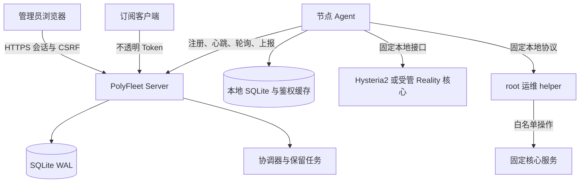

# PolyFleet 项目概览

本文面向准备部署、维护或参与开发 PolyFleet 的读者。它从实际问题出发，说明当前需求、
技术选型、架构边界、主要数据流、部署运维方式和发布质量门槛。具体版本的兼容范围仍以
[兼容性矩阵](compatibility.md)和 Release 说明为准。

## 1. 项目要解决的问题

少量 VPS 也会形成重复而容易出错的管理工作：每台机器可能使用不同的面板或配置文件，
用户密码、到期时间、节点分配、流量、在线状态、订阅和服务健康分散在多个入口。控制面
越多，迁移、备份和故障定位也越难。

PolyFleet 提供一个小型自托管控制面，并在每台节点部署出站连接的 Agent。它通过带类型的
适配器管理原生 Hysteria2 和固定 VLESS/TCP/Reality 配置，采集主机与代理核心状态，执行
有限运维，同时保留代理数据面的独立性。控制面短暂不可用时，已经应用的配置仍可传输
流量；Agent 在恢复连接后继续收敛并补发结果。

## 2. 目标、约束与非目标

### 功能目标

- 登记、编辑、停用和归档节点，使用短期一次性 Token 完成 Agent 注册。
- 创建全局用户，管理启用状态、到期时间、节点分配和全局或单节点额度。
- 每个“用户 - 节点”分配使用独立凭据，并支持明确的单项或整组轮换。
- 在原生 Hysteria2 节点提供 HTTP 鉴权、本地缓存、流量统计、在线状态和踢下线。
- 在专用干净节点管理固定 VLESS/TCP/Reality sing-box 配置、用户、双向流量、在线连接和
  定向断开。
- 输出 Hysteria2/VLESS URI、Base64、Mihomo/Clash 和 sing-box 统一订阅。
- 记录每台节点的手工双向月流量额度、重置日、服务商控制台校准值和分级告警。
- 采集主机资源、代理核心、主要进程和 systemd 服务快照，保留受限的历史指标。
- 提供核心探测、重启、有限日志和本地配置备份，记录结果并产生告警。
- 节点离线或控制面暂时断开后，自动追平期望状态、流量批次和运维结果。

### 非功能约束

- 适用于低配置 VPS：生产环境不依赖 Node.js、Redis、消息队列或外部数据库。
- Agent 只发起出站 HTTPS 请求，不开放公网管理端口。
- 用户变更采用期望状态和最终一致性；界面必须区分待同步、已应用、失败和离线。
- 流量批次和运维结果可重试且幂等，不能因网络重传重复记账或重复执行。
- 指标和列表必须有采样、返回条数和保留时间上限，避免低内存节点被监控本身拖垮。
- 任何适配器都不能默认修改未被 PolyFleet 创建或显式接管的资源。

### 当前非目标

- 计费、收款、套餐销售、经销商或客户自助门户。
- 通用远程 Shell、网页终端、SSH 密钥托管、文件管理器或完整 RMM。
- 自动购买 VPS、配置 DNS、操作系统补丁管理或任意 systemd 服务控制。
- 高可用控制面、数据库集群、Kubernetes 或超大规模节点编排。
- 任意 sing-box JSON、未审核协议配置，以及多管理员细粒度 RBAC。

## 3. 技术栈与选择理由

| 层 | 选择 | 理由 |
| --- | --- | --- |
| Server 与 Agent | Go，静态 Linux 二进制 | 运行依赖少、内存可控、并发和交叉编译成熟，适合小型 VPS |
| 管理界面 | Vue 3、TypeScript、Vite、Naive UI | 组件与类型体系完整；构建结果嵌入 Server，生产环境无需 Node.js |
| 数据库 | SQLite WAL | 单控制面无需外部数据库；事务、备份和迁移能力足够，运维成本低 |
| 节点通信 | Agent 主动 HTTPS 轮询 | 无需开放 Agent 端口，穿越常见 NAT 和防火墙更容易，故障模型清晰 |
| 状态同步 | 版本化期望状态、最终一致性 | 节点断线不阻塞管理事务，恢复后可按版本自动追平 |
| 进程监督 | systemd | 与目标 Debian/Ubuntu 主机一致，支持专用账户、重启策略和沙箱 |
| 特权操作 | root helper 与 Unix socket | 将 Agent 保持为低权限进程，只把固定的少量动作交给 root 执行 |
| Server 容器 | Docker Compose，可选 | 为已有容器环境提供入口；Agent 仍需直接访问 systemd 和核心配置 |
| CI 与发布 | GitHub Actions | 在干净系统测试安装、升级和恢复，并生成校验和、SBOM 与签名 |

SQLite 是有意的范围选择。PolyFleet 面向少量节点，短事务、WAL、有限连接池和批量清理可以
提供足够并发；在没有测量依据前，引入 PostgreSQL 或消息队列只会增加故障点和资源占用。

## 4. 总体架构



### 控制面 Server

Server 提供管理员 API、Agent API、订阅端点和嵌入式管理界面。它负责保存全局用户、节点、
分配、加密凭据、流量总计、操作记录、告警和指标历史，并根据数据库中的事实生成每台节点
的期望快照。后台协调器只执行小型、有超时和批量上限的任务。

### 节点 Agent

Agent 使用节点专属凭据主动连接 Server。它缓存最后一次有效期望状态，调用本机适配器，
采集流量和状态，并把尚未确认的流量批次与操作结果保存在本地 SQLite Outbox。Agent
重启或网络恢复后继续发送同一批次，Server 通过唯一 ID 幂等接收。

### root 运维 helper

普通 Agent 没有任意 root 权限。由 systemd socket 按需启动的 helper 只接受固定协议，
操作对象在安装配置中确定。它不能接收 Shell 命令、任意服务名或任意路径；日志行数、返回
大小、备份目录、文件数量、层级和总大小均有上限。

### 代理数据面

Hysteria2 或受管 sing-box 独立承载用户流量。PolyFleet 不重新实现 QUIC、TLS 或代理
协议。原生 Hysteria2 通过 loopback HTTP 接口调用 Agent 鉴权，并通过 loopback Traffic
Stats API 提供累计流量和在线信息。Reality 适配器只接受一个审计过的固定配置和固定本地
API，不接受管理员上传任意 JSON。

## 5. 核心领域模型

| 对象 | 作用 |
| --- | --- |
| Node | 节点身份、公网端点、适配器、能力、期望和已应用版本、最近状态 |
| User | 稳定用户 ID、显示名、启用状态、到期时间和全局额度 |
| Assignment | 用户在某节点上的成员关系、独立凭据、单节点额度和同步状态 |
| Subscription Token | 只保存哈希的不透明访问 Token，可撤销、到期和轮换 |
| Traffic Batch | Agent 生成的唯一批次，包含某节点、用户和来源 epoch 的流量增量 |
| Operation | 固定类型、节点内单调序列、有效期、尝试次数和脱敏结果 |
| Alert | 节点离线、核心异常、同步、流量或运维失败的活动与恢复状态 |
| Metric Sample | 有保留上限的主机时间序列及最新进程、服务快照 |

Assignment 是管理边界的关键：同一用户在不同节点使用不同凭据，某一节点失陷不会直接
暴露其他节点的用户密码。凭据轮换期间区分“期望凭据”和“已应用凭据”，只有 Agent 确认
成功的端点才能进入新生成的订阅。

## 6. 主要数据流与一致性

### 节点注册

1. 管理员创建节点并生成短期、一次性注册 Token。
2. Agent 生成安装标识，通过 HTTPS 提交 Token、版本和能力。
3. Server 消费一次性 Token，签发节点专属长期凭据，只保存其不可逆校验材料。
4. Agent 以 `0600` 保存凭据；之后不再需要注册 Token。

### 用户变更与鉴权

1. 用户、分配或额度变更在 Server 的单个事务中提交，并递增受影响节点的期望版本。
2. Agent 轮询到较新快照，先验证和应用，再回报结果；失败时保留上一份可用状态。
3. 原生 Hysteria2 把用户提交的 secret 发到 Agent loopback 鉴权端点。
4. Agent 使用本地 verifier 缓存校验启用、到期和最近同步的额度状态，返回稳定用户 ID。

控制面断线不会清空缓存。新建、停用、到期或额度变更在断线节点上属于最终一致性，界面
必须展示最后成功应用时间，管理员不能把“已保存”误认为“所有节点已生效”。

### 流量、在线状态与踢下线

Agent 读取核心累计计数，与本地持久基线计算增量。计数器下降或核心实例变化会开始新的
source epoch。发送前先把 UUID 批次写入 Outbox；Server 在唯一约束和总计更新的同一事务
中接收，因此重复请求不会重复计费。在线状态是瞬时观察值，不作为计费依据；踢下线通过
单调 generation 表达，重复同步不会产生无限操作。

### 统一订阅与凭据轮换

订阅 URL 使用只保存哈希的不透明 Token。输出仅包含用户已启用、未到期、额度可用、节点
端点完整、适配器兼容且已成功应用的 assignment。Server 只在生成响应时短暂解密对应
凭据，不在日志或审计元数据中保存明文。撤销旧 Token 或轮换凭据后，客户端需要刷新订阅。

### 运维操作与离线补同步

Server 为每个节点分配单调 operation sequence 和过期时间。Agent 把执行结果写入本地
Outbox 后再上报；helper 还按 operation ID 保存本地结果，避免重投导致二次重启。失败或
过期操作只能由管理员显式重试并获得新的 ID。节点恢复连接后，先补发旧结果，再拉取新的
期望状态和操作。

## 7. 适配器与原生收敛

| 适配器 | 管理边界 |
| --- | --- |
| `native_hysteria2` | 完整用户、鉴权、流量、在线、订阅和有限运维，推荐长期使用 |
| `sing_box_vless_reality` | 固定 VLESS/TCP/Reality 配置、用户、流量、在线、订阅和定向断开 |
| `s_ui` | 先探测和只读导入，只有显式接管且成功同步的客户端才由 PolyFleet 管理 |
| `standalone_sing_box` | 主机与核心观察、重启、有限日志和配置备份；不管理用户或订阅 |

迁移现有节点时应新建临时原生节点记录，在空闲 UDP 端口完成鉴权、订阅、流量、在线和运维
验收，再在维护窗口切换生产端口。旧服务先停止并保留可回滚副本，观察稳定后才卸载或删除；
旧节点解除用户分配并归档，不能直接把带有旧所有权历史的记录改成另一种适配器。

## 8. 主机监控模型

Agent 以固定间隔采集 CPU、内存、Swap、根分区、磁盘 I/O、网络、负载、运行时间、主机
与内核信息。Server 保留受限的聚合历史，并限制每次查询点数。当前每次详细遥测最多上报
16 个主要进程和 128 个 systemd 服务，以最新快照呈现，而不是无限累积每条服务历史。
进程集合兼顾 CPU 和 RSS 排名，避免只按一个维度遗漏主要负载。

进程快照仅上传观察所需的 PID、进程名、CPU、RSS、归属服务和运行时间等字段，不上传
命令行参数、环境变量或打开的文件，因为其中可能包含密码和 Token。服务面板用于定位
资源消耗和核心状态，不是通用 systemd 管理器；PolyFleet 不因此获得重启任意服务的能力。

为了让非 root Agent 读取其他用户进程的基础计数和 cgroup 归属，原生 systemd 单元使用
`ProtectProc=default`，不再在 Agent 自己的挂载命名空间内隐藏其他 PID。这是主机进程可见性
与监控完整度之间的明确取舍；`NoNewPrivileges`、专用账户和文件系统限制仍然保留。若主机
全局启用了更严格的 `hidepid` 或其他 `/proc` 限制，进程部分会报告不可用，但心跳、主机指标
和 systemd 服务采集仍应继续工作。

指标是尽力采集的运维数据，不是账单依据。单次采集失败不能阻断基础心跳，也不应把所有
节点误判为离线。查看异常值时应与节点本机的 `/proc`、`systemctl`、`free`、`df`、
`ss` 和 `journalctl` 交叉验证。

## 9. 安全模型

### 信任边界

- Server 是最高信任组件。数据库中的 assignment 凭据使用外部 master key 加密。
- 每个 Agent 只有节点级权限。攻陷一台节点不应取得其他节点或 Server 的凭据。
- 订阅持有者只能访问对应用户的订阅输出，不能使用订阅 Token 调用管理 API。
- S-UI API Token 仅保存在对应节点，不发送到 Server；兼容适配器不记录原始响应。

### 关键防护

- 管理会话使用服务端 session、Secure Cookie 和 CSRF 防护；Server 必须位于可信 HTTPS
  反向代理后方。
- 管理员密码使用 Argon2id；注册 Token 短期且一次性；订阅和节点长期 Token 只存哈希。
- 日志、审计、错误和指标对 Authorization、密码、Token 与完整订阅 URL 做限制和脱敏。
- systemd 单元使用专用账户、`NoNewPrivileges` 和文件系统限制；root helper 只暴露固定
  本地协议。
- 配置备份留在节点本机，Server 只保存路径、大小、哈希和时间等元数据。
- Server 备份归档与 master key 分离。两者都必须复制到加密的异机存储。

root 攻陷仍然意味着该节点完全失陷；Server 与 master key 同时失陷可能影响整个 fleet。
PolyFleet 通过缩小权限和秘密传播范围降低影响，但不能消除主机级入侵风险。

## 10. 部署与资源预算

### 推荐拓扑

- 一台稳定节点运行原生 `hyfleet-server` 和 SQLite，通过 Caddy 或 Nginx 暴露 HTTPS。
- 每台代理节点运行 `hyfleet-agent`、按需启动的 operations helper，以及独立 Hysteria2
  核心或 PolyFleet 固定版本的 Reality sing-box 核心。
- 控制面与节点可以共机；TCP 443 的 HTTPS 面板和 UDP 443 的 Hysteria2 可以同时使用。
- Docker 仅适合 Server。Agent 需要本机 systemd、Unix socket 与受限配置路径，不应容器化。

工程预算以 Agent 空闲 RSS 不高于约 30 MiB、Server 空闲 RSS 不高于约 80 MiB 为目标，
实际值还取决于内核、SQLite 页面缓存、指标数量和节点数。Hysteria2、反向代理和操作系统
资源不计入 PolyFleet 本身。预算是发布门槛，不是未经测量的保证。

### 原生安装

公开仓库可以从同一 Release tag 下载并审阅 `install.sh`，再显式传入该版本。安装器检查
Debian/Ubuntu、systemd、amd64/arm64、外层 SHA-256、归档路径和包内 `SHA256SUMS`。
Server 默认监听 loopback；DNS、TLS 和反向代理由管理员负责。

私有仓库不应让 VPS 保存长期 GitHub Token。应在已执行 `gh auth login` 的管理机下载
Release，再由 `scripts/deploy-fleet.ps1` 或 SCP 上传经过校验的归档。一次性 Agent 注册
Token 只在安装器无回显提示中输入。

### 升级与回滚

1. 阅读 Release 说明和兼容性矩阵，确认 Server 支持当前 Agent 协议。
2. 创建 Server 一致性备份，并把归档和 master key 分开复制到异机。
3. 先升级 Server，再升级 Agents；小型 fleet 可使用并行更新脚本。
4. 更新器保存旧二进制、systemd 单元、配置和标准数据文件，运行配置及健康检查。
5. 健康检查失败时自动恢复该组件；成功后仍应保留快照直到观察期和异机备份完成。

数据库迁移可能不可逆。二进制回滚不等于数据库降级；跨迁移降级必须恢复升级前快照。

### 备份与恢复

原生 Server 使用 `deploy/backup-server.sh` 通过 SQLite backup API 创建一致快照，而不是
直接复制活动 WAL 数据库。恢复脚本验证外层和内层哈希、32 字节 master key、SQLite
完整性、外键、Schema 和配置路径；新服务健康检查失败时恢复操作前的数据。

Agent 状态通常可以重新生成，但未上报流量、操作结果和兼容适配器映射位于本地数据库。
节点迁移或重装前应做加密备份。核心配置备份不会自动上传到控制面，磁盘保留策略仍由
管理员负责。

### 常用验收

```bash
sudo systemctl is-active hyfleet-server
sudo systemctl is-active hyfleet-agent hyfleet-agent-ops.socket
curl --fail http://127.0.0.1:8080/healthz
sudo journalctl -u hyfleet-agent -n 100 --no-pager
```

只在实际运行对应组件的主机执行相应命令。验收还应包含外部 HTTPS、Agent 重新上线、
订阅刷新、真实客户端连接、流量增量、一次正常核心重启和一次异机恢复演练。

## 11. 开发、测试与发布

### 本地工具链

- Go 1.26
- Node.js 22
- pnpm 11.16
- Linux systemd 环境用于原生安装和服务单元验收

日常检查：

```bash
go mod verify
go test ./...
go vet ./...
pnpm --dir web install --frozen-lockfile
pnpm --dir web typecheck
pnpm --dir web test
pnpm --dir web lint:docs
pnpm --dir web build
```

涉及 Go 并发、Outbox、存储或协议的变更还应运行 `go test -race ./...`。安装器、备份格式、
凭据、订阅、注册、迁移或 root helper 的变更必须增加失败路径测试和对应文档。

### CI 质量门槛

`main` 和 Pull Request 的 CI 会执行：

- Go 格式、module 校验、`go vet`、race tests 和 Linux amd64/arm64 构建；
- Vue typecheck、组件测试、Markdown lint 和嵌入式前端构建；
- Shell 语法、ShellCheck、GitHub Actions lint 和 `git diff --check`；
- gitleaks 秘密扫描；
- Ubuntu 24.04、Debian 12 和 Debian 13 干净环境中的安装、升级、备份和恢复；
- Docker Compose 模型验证、镜像构建、健康检查和数据库检查。

### Release 流程

1. 在干净工作区完成全部 CI 检查，更新兼容性和用户可见文档。
2. 创建符合 `vX.Y.Z` 的 tag；包含连字符的 tag 作为预发布版本。
3. Release workflow 从该 tag 重新验证源码，分别构建 amd64 和 arm64 归档。
4. 为归档生成外层 SHA-256 和包内 `SHA256SUMS`，为每个架构生成 SPDX JSON SBOM。
5. GitHub OIDC 驱动 Cosign 为发布文件生成 keyless Sigstore bundle。
6. 发布多架构 GHCR Server 镜像、provenance、SBOM，并按镜像 digest 签名。
7. 下载 Release 到独立目录，重新验证校验和和签名，再执行滚动升级与验收。

SHA-256 只有在校验文件来源可信时才能证明完整性；稳定发布应同时验证 Sigstore bundle
中的仓库、workflow、tag 和 GitHub OIDC issuer。不得把长期签名私钥放入仓库或 CI。

## 12. 已知边界与演进方向

- 原生 Hysteria2 与固定 VLESS Reality 是完整受管路径；S-UI 和 standalone sing-box 是
  迁移兼容入口。
- 告警当前以控制台状态为主；外部邮件、Webhook 或消息平台通知需要独立的秘密和重试设计。
- 节点本地核心备份没有自动远端归档或统一清理策略。
- 服务商流量通常没有统一 API；节点月额度依赖管理员录入，并可用控制台当前用量校准。
- 主机指标用于观察，不提供完整 APM、日志平台或通用进程控制。
- 扩展到多管理员、客户自助和计费前，需要单独设计 RBAC、审计、租户隔离和合规边界。
- 节点数或写入量超出 SQLite 预算时，应先做基准和锁竞争测量，再通过 ADR 评估外部数据库。

完整文档入口见[文档索引](README.md)，架构约束的变更应通过新的 ADR 记录，而不是静默
改写已经接受的历史决策。

## 13. HyFleet 兼容运行时

PolyFleet `v1.3.0` 为了原地升级保留 `hyfleet-server`、`hyfleet-agent`、systemd unit、
`/etc/hyfleet`、`/var/lib/hyfleet*`、`HYFLEET_*`、`X-HyFleet-*` 和 Reality 本地 API
路径。这些是兼容 ABI，不是当前产品名。公开源码、Release 资产和容器镜像使用
PolyFleet；生产部署不应手工重命名兼容路径。
